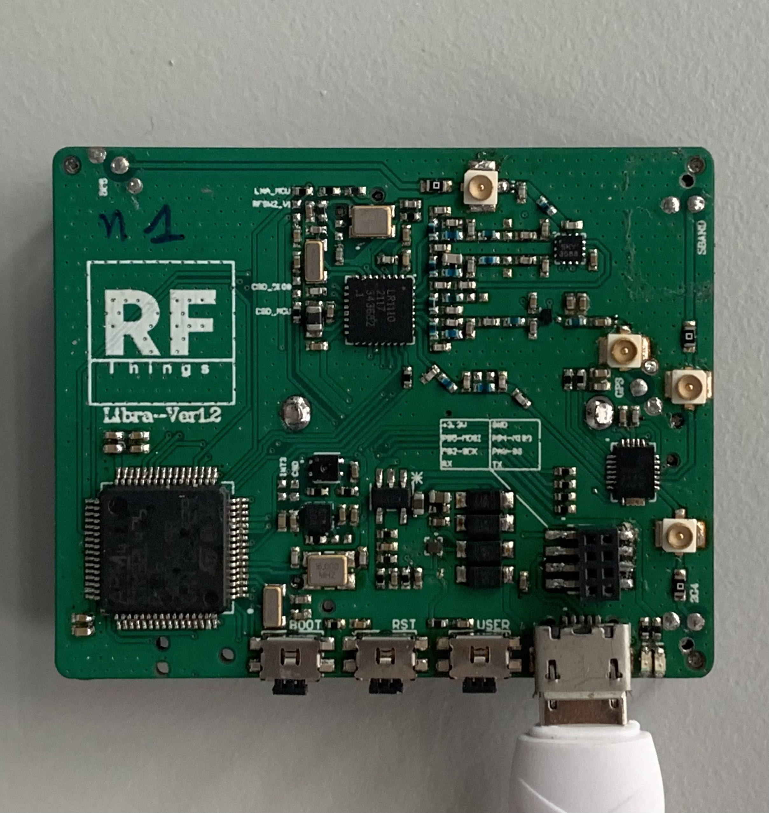
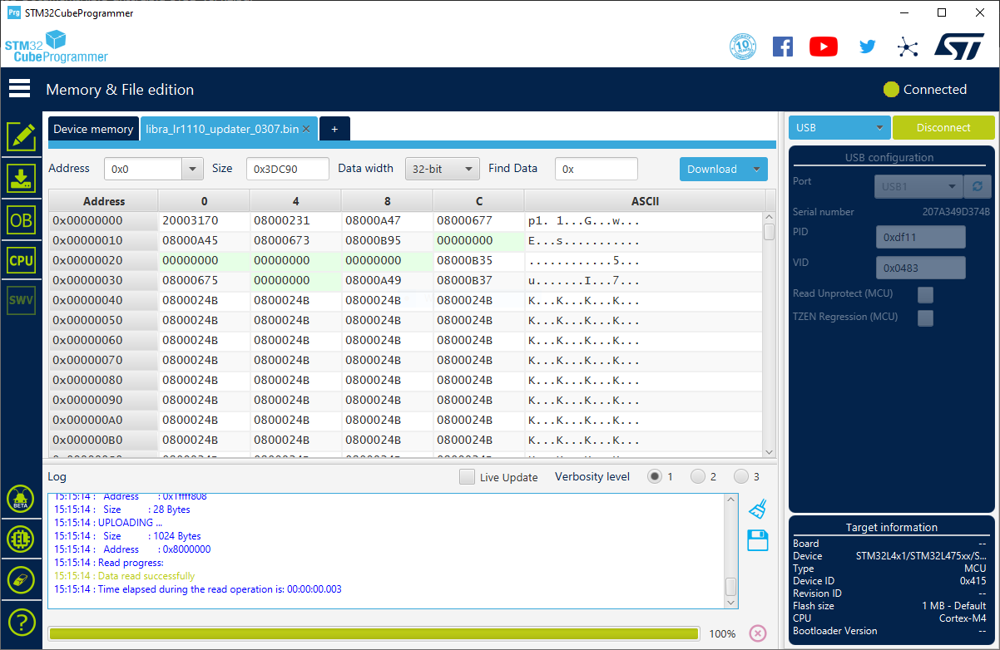
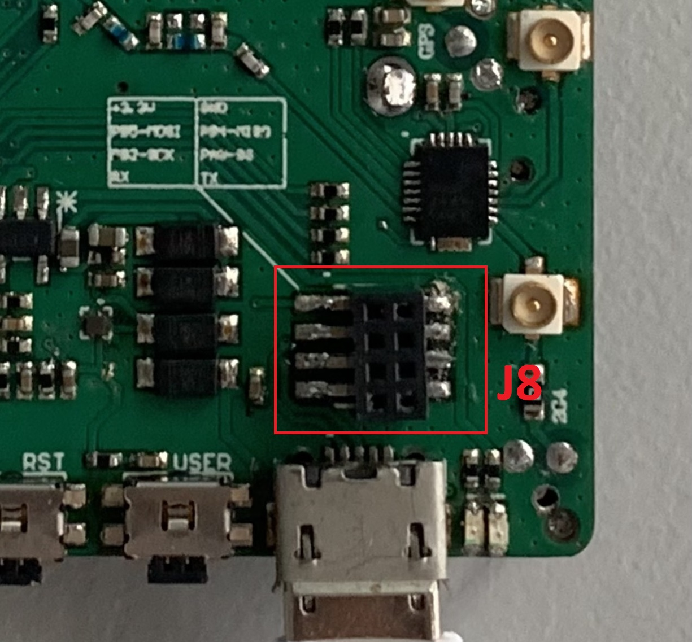
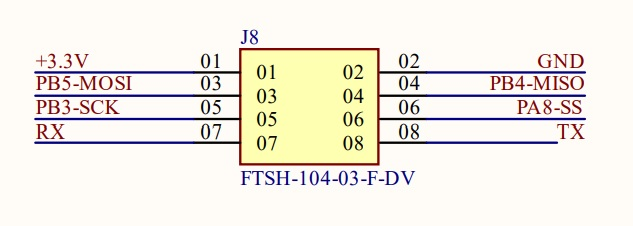
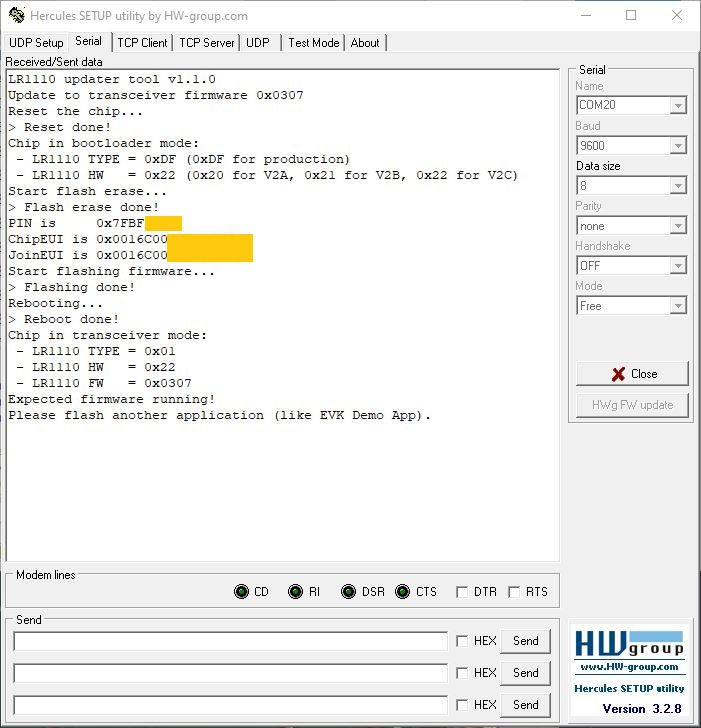

# LR1110 Updater tool (for RFThings Libra ver1.2)

## Introduction

This project gives an implementation example of the flash memory update mechanism available in the LR1110 radio.

The project is developed for the following configuration:

-   [RFThings](https://rfthings.com.vn) Libra Board ver1.2

<b>This project is not compiled with GUI & LCD driver to reduce the flash size. Therefore, it could be easier to use with 265KB Flash MCU (STM32RCT6).</b>

## Compilation

The user can chose the firmware to be compiled thanks to this tool by defining the header file to be included in main.c file before launching the compilation.

For instance:

-   `#include "lr1110_trx_0303.h"` for transceiver firmware 0x0303
-   `#include "lr1110_trx_0304.h"` for transceiver firmware 0x0304
-   `#include "lr1110_trx_0305.h"` for transceiver firmware 0x0305
-   `#include "lr1110_trx_0306.h"` for transceiver firmware 0x0306
-   `#include "lr1110_trx_0307.h"` for transceiver firmware 0x0307

Firmware images are available in this repository but it also can be downloaded from the [**dedicated Semtech Github repository**](https://github.com/Lora-net/radio_firmware_images/tree/master/lr1110)

There are 2 ways to get the binary file:

-   <b>Keil project</b> available in keil folder (Recommended)
-   <b>makefile</b>

## Download compiled binary file

The compiled binary file can be download to STM32L476 chip with [STM32CubeProgrammer](https://www.st.com/en/development-tools/stm32cubeprog.html) (Reccommended) or other relevant ultities by the following interfaces:

- Built-in USB / USB DFU (Recommended)
- ST-Link

For the Built-in USB / USB DFU interface, the Libra board need to be in DFU Mode by pressing on-board buttons as the following sequences:

- Hold <b>Boot</b> button
- Press <b>RST</b> button
- Release <b>Boot</b> button

Check out this document from STMicroelectronics for more details about USB DFU Protocols: [AN3156: USB DFU protocol used in the STM32 bootloader](https://www.st.com/content/ccc/resource/technical/document/application_note/6a/17/92/02/58/98/45/0c/CD00264379.pdf/files/CD00264379.pdf/jcr:content/translations/en.CD00264379.pdf)

For ST-Link interface, the compiled binary file can also be downloaded directly via Keil.

## Updater operations

The user can get information about the update status through the following interfaces:

-   LED: The user LED (Blue) on pin PC8 indicates the downloading process. This LED turns ON when the downloading start and OFF as soon as the downloading stop. (NOT indicate if the downloading process is success)
-   UART port: All downloading process information can be read (with bitrate set to 9600 bps) via USART2 (PA2/TxD | PA3/RxD). This serial peripheral can be accessed via Head J8.

### Goodluck!
